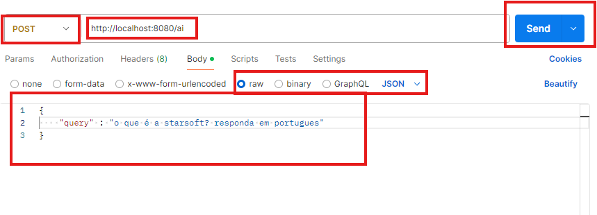
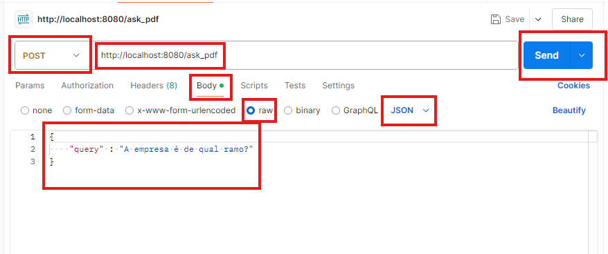
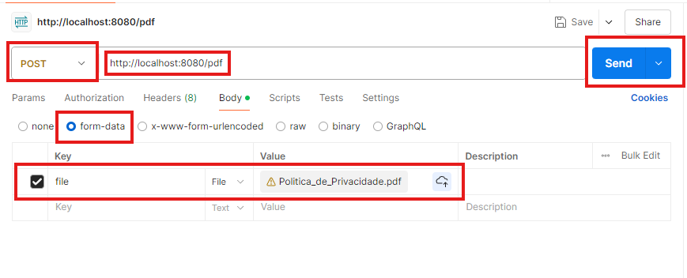

##  StarSoft - AI Development Test

Este repositório contém uma aplicação construída como parte de um teste técnico para a empresa **Starsoft**. O projeto tem como objetivo demonstrar o uso de **LangChain**, **ChromaDB**, **Ollama**, **Docker Compose** e, como um adiconal, utilização de **Flask API** em um sistema de Recuperação Aumentada de Conhecimento (RAG).

## **Descrição do Projeto**

O sistema consiste em uma aplicação web que oferece dois principais endpoints:

1. **/ai**: Endpoint para realizar consultas diretas ao modelo de linguagem integrado, utilizando **Ollama**.
2. **/ask_pdf**: Endpoint que permite realizar consultas baseadas em arquivos PDF previamente enviados e processados, utilizando **LangChain** para construção de cadeias de recuperação e **ChromaDB** como banco de dados vetorial para armazenar os embeddings gerados.

Além disso, um endpoint adicional (**/pdf**) permite o upload de arquivos PDF, que são automaticamente processados e armazenados no banco de dados vetorial.

### **Principais Tecnologias Utilizadas**

- **LangChain**: Utilizado para criar cadeias de recuperação de documentos, permitindo consultas eficientes com base em textos processados e indexados a partir de PDFs.
- **ChromaDB**: Banco de dados vetorial utilizado para armazenar os embeddings gerados a partir dos documentos PDF.
- **Ollama**: Integrado como modelo de linguagem principal para consultas diretas e para geração de respostas nas cadeias de recuperação.
- **Flask API**: Utilizado para criar a API da aplicação que gerencia as requisições HTTP, oferecendo endpoints para interação com o modelo de linguagem e processamento de PDFs. A API pode ser facilmente testada utilizando ferramentas como o **Postman** para enviar requisições POST e verificar as respostas.
- **Docker Compose**: Utilizado para orquestrar o ambiente de contêineres da aplicação, incluindo o contêiner Flask para a API e o contêiner ChromaDB para o armazenamento vetorial persistente.

## **Como Executar o Projeto**

### **Pré-requisitos**

- Docker e Docker Compose instalados na sua máquina.
- Postman para realizar requisições HTTP e testar os endpoints. Você pode baixá-lo através do [link oficial](https://www.postman.com/downloads/).

### **Passos para Execução**

1. Clone o repositório:

   Relizar Clone do Repositório através do acesso ao link do GitHub

2. Inicie o contêiner do app utilizando o Docker Compose:

    Execute os comandos na seguinte sequentia:
    2.1 docker compose build 
    2.2 docker compose up
    2.3 docker compose run app /bin/bash

3. Dentro do contêiner, execute o seguinte comando para iniciar a aplicação:

    python app.py

### **Testando os Endpoints com Postman**

Utilize o **Postman** para testar os endpoints da aplicação. Abaixo estão as instruções para realizar requisições HTTP POST para cada um dos endpoints disponíveis:

- **/ai [POST]**: Realize uma consulta direta ao modelo de linguagem.
  - **Requisição**: Envie um JSON no corpo da requisição com o campo `query`.
  - **Exemplo de Corpo da Requisição**:
    

- **/ask_pdf [POST]**: Realize uma consulta nos documentos carregados no banco de dados vetorial.
  - **Requisição**: Envie um JSON no corpo da requisição com o campo `query`.
  - **Exemplo de Corpo da Requisição**:
    

- **/pdf [POST]**: Faça o upload de um arquivo PDF para o sistema.
  - **Requisição**: Envie o arquivo PDF utilizando o campo `file` do formulário (no Postman, utilize a opção `form-data`).
  - **Exemplo**:
    

Após enviar as requisições, você poderá visualizar as respostas retornadas pela API diretamente no Postman.   
